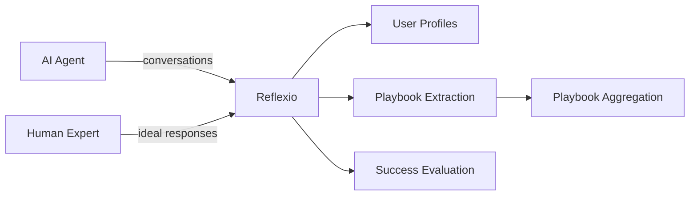
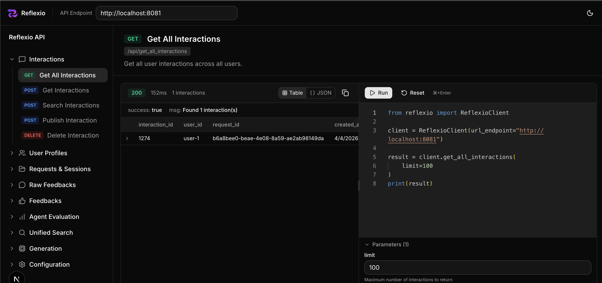

<p align="center">
  <a href="https://github.com/reflexio-ai/reflexio">
    
  </a>
</p>
<div align="center">

[](https://www.python.org/)
[](LICENSE)
[](https://pypi.org/project/reflexio-ai/)
[](https://pepy.tech/project/reflexio-ai)
[](reflexio/benchmarks/retrieval_latency/results/report.md)
[](https://github.com/ReflexioAI/reflexio/stargazers)
[](https://discord.gg/7fnCxahase)

[Quick Start](#quick-start) · [Features](#features) · [Integrations](#integrations) · [SDK](#sdk-usage) · [CLI](reflexio/cli/README.md) · [Architecture](#architecture) · [Docs](https://www.reflexio.ai/docs) · [Community](#community) · [Contributing](#contributing)

</div>

---

<p align="center">
  <b>81% fewer planning steps</b> &nbsp;·&nbsp; <b>72% less tokens</b> &nbsp;·&nbsp; on real GDPVal knowledge-work tasks, <br/>
  <i>on top of</i> what a SOTA self-improving Hermes agent already learns on its own.<br/>
  <a href="benchmark/gdpval/RESULTS.md"><b>See the benchmark →</b></a>
</p>

---

### Migration from the removed claude_code integration

The `reflexio setup claude-code` command and its hook files have been removed.
The replacement is **[claude-smart](https://github.com/ReflexioAI/claude-smart)**,
a standalone Claude Code plugin distributed via npm.

*This migration only removes the **hook/plugin installation** path. The local
`claude-code` LLM provider routing (used to call Anthropic via the Claude Code
CLI binary as a model backend) remains available — only remove obsolete hook
entries, not your provider configuration.*

**If you had the old integration installed**, your `.claude/settings.json` (per-project)
or `~/.claude/settings.json` (global) likely has hook entries referencing files that no longer exist.
Open the file and remove any `hooks` entries that reference paths under `reflexio/integrations/claude_code/`
or `integrations/claude_code/`. Then run `npx claude-smart install` (or use the Claude Code plugin marketplace)
for the modern equivalent.

---

## What is Reflexio?
Reflexio is an **AI agent self-improvement harness** that enables your AI agents to continuously learn from real user interactions. It turns user corrections into persisted behavioral improvements for agents and captures successful execution paths for reuse.

User-specific learnings stay scoped to that user; lessons that recur across users can be aggregated into shared agent playbooks and approved for reuse.

As your agent is used more, it becomes smarter, faster, and more effective at solving domain-specific tasks.
The moat for AI agents is what your agent learns from every interaction it handles.  

Our vision is that AI systems should get better with every interaction.

> **Benchmarked on GDPVal**: on 4 of 5 real knowledge-work tasks from OpenAI's public GDPVal benchmark, Reflexio cuts a **median −81% planning steps and −72% tokens** on a Hermes agent running `minimax/MiniMax-M2.7` — measured against a *warm baseline*: the same agent re-running the task after it has already learned from itself. In other words, Reflexio's savings come **on top of** what a SOTA self-improving agent has learnt on its own. See the full writeup → [benchmark/gdpval/RESULTS.md](benchmark/gdpval/RESULTS.md).



Publish conversations from your agent, and Reflexio closes the self-improvement loop:

- **Never Repeat the Same Mistake**: Transforms user corrections and interaction signals into improved decision-making processes — so agents adapt their behavior and avoid repeating the same mistakes.
- **Lock In What Works**: Persists successful strategies and workflows so your agent reuses proven paths instead of starting from scratch.
- **Transfer Learning Across Users**: Corrections and successful strategies that recur across users can be aggregated into shared agent playbooks; approved playbooks improve the agent for everyone without retraining.
- **Learn from Human Experts**: Publish expert-provided ideal responses alongside agent responses — Reflexio automatically extracts actionable playbooks from the differences.

> **For developers**: See [developer.md](developer.md) for project structure, environment setup, testing, and coding guidelines.

## Table of Contents

- [Demo](#demo)
- [Quick Start](#quick-start)
- [Features](#features)
- [Integrations](#integrations)
- [SDK Usage](#sdk-usage)
- [Architecture](#architecture)
- [Documentation](#documentation)
- [Community](#community)
- [Contributing](#contributing)
- [Star History](#star-history)
- [License](#license)

## Demo

<p align="center">
  
</p>

## Quick Start

### Prerequisites

| Tool | Description |
| --- | --- |
| [Python](https://www.python.org/) >= 3.12 | Required for PyPI and source installs |
| [uv](https://docs.astral.sh/uv/getting-started/installation/) | Required when running from source |
| [Node.js](https://nodejs.org/) >= 18 | Required only for the local docs site in a source checkout |

<p align="center">
  
</p>

### Setup

**Option A — Install from PyPI** (fastest, for users):

```shell
pip install reflexio-ai

# start/stop services. data saved under ~/.reflexio
reflexio services start           # API (8061), inference (8069), SQLite storage
reflexio services stop            # Stop all services
```

The PyPI package does not ship the local docs site. Use the
[hosted documentation](https://www.reflexio.ai/docs), or clone the repository
if you want to run the docs locally.

**Option B — Clone from source** (for contributors):

```shell
# clone the repo
git clone https://github.com/ReflexioAI/reflexio.git
cd reflexio

# configure: copy env template, then set at least one LLM API key (OpenAI, Anthropic, etc.)
cp .env.example .env

# install dependencies
uv sync                                    # Python (includes workspace packages)
npm --prefix docs install                  # API docs

# start/stop services. data saved under ~/.reflexio
uv run reflexio services start             # API (8061), Docs (8062), inference (8069), SQLite
uv run reflexio services stop              # Stop all services
```

> Source-checkout alternatives: `python -m reflexio.cli services start` or `./run_services.sh`

When the backend is selected, the launcher also starts the local inference
service on port 8069 unless `REFLEXIO_EMBEDDING_SERVICE_URL` points to a remote
service. It serves embeddings and the optional cross-encoder reranker; cloud
embedding configurations still use it for reranking. The deployment-wide
`REFLEXIO_RERANK_ENABLED` flag defaults to `true`. Set it to `false` to skip
reranker model loading/prewarm and disable reranker requests. Automatic
unified-search relevance flooring (which includes reranking) remains separately
off by default through `retrieval_floor.enabled`. If the loopback inference
service is unavailable, automatic reranking is silently skipped and retrieval
order is preserved. An unavailable remote/internal service is reported while
search still fails open.

For a source checkout, open **[http://localhost:8062](http://localhost:8062)**
to interactively browse and try out the API.
<p align="center">
  
</p>

### Try it in 30 seconds (CLI)

Reflexio ships a first-class CLI — the fastest way to see the loop end-to-end with no code. Publish a real multi-turn conversation where the user **corrects** the agent (that's the signal Reflexio learns from), then search for what was extracted. In a source checkout, prefix these commands with `uv run`.

```shell
reflexio publish --user-id alice --session-id deploy-demo-1 --wait --data '{
  "interactions": [
    {"role": "user",      "content": "Deploy the new service."},
    {"role": "assistant", "content": "Starting deployment to us-east-1..."},
    {"role": "user",      "content": "Wait — we never deploy production to us-east-1. Always use us-west-2."},
    {"role": "assistant", "content": "Understood. Switching to us-west-2."}
  ]
}'

# Search the extracted profiles and playbooks
reflexio search "deployment region" --user-id alice
```

Depending on the configured model and extraction gates, this conversation can
produce a user profile (`production region is us-west-2`) and a user playbook
(`confirm region before deploying`). Agent playbooks are created later by
aggregating recurring user playbooks across users and enter the approval
workflow. See the [CLI reference](reflexio/cli/README.md) for all input modes
(inline JSON, `--file`, `--stdin`) and the full command list.

### Integrate with the Python SDK

```python
import reflexio

client = reflexio.ReflexioClient(
    url_endpoint="http://localhost:8061/"
)

# Publish a multi-turn conversation where the user corrects the agent —
# Reflexio can extract a profile ("prod region = us-west-2") and a playbook
# ("confirm region before deploying").
client.publish_interaction(
    user_id="alice",
    interactions=[
        {"role": "user",      "content": "Deploy the new service."},
        {"role": "assistant", "content": "Starting deployment to us-east-1..."},
        {"role": "user",      "content": "Wait — we never deploy production to us-east-1. Always use us-west-2."},
        {"role": "assistant", "content": "Understood. Switching to us-west-2."},
    ],
    session_id="deploy-demo-1",
)
```

By default, Reflexio queues profile and playbook extraction in the background;
the configured models and extraction gates determine which artifacts are produced.

## Features

### Profile Generation

- Extracts stable facts about users and their environments with one configurable profile extractor
- Supports versioning (current → pending → archived) with upgrade/downgrade workflows
- Supports global extraction windows and strides with profile-specific overrides

[Read more about user profiles →](https://www.reflexio.ai/docs/concepts/user-profiles)

### Playbook Extraction & Aggregation

- Extracts playbooks from user behavior patterns
- Clusters similar entries and aggregates with LLM (with change detection to skip unchanged clusters)
- Approval workflow: review and approve/reject agent playbooks

[Read more about agent playbooks →](https://www.reflexio.ai/docs/concepts/agent-playbook)

### Expert Learning

- Publish human-expert ideal responses alongside agent responses via the `expert_content` field
- Reflexio automatically compares agent vs. expert responses, focusing on substantive differences (missing info, incorrect approach, reasoning gaps) while ignoring stylistic ones
- Generates actionable playbooks as trigger/instruction/pitfall SOPs that teach the agent what to do differently

[Read more about interactions & expert content →](https://www.reflexio.ai/docs/build/user-interactions#expert-examples)

### Agent Success Evaluation

- Session-level evaluation sampled automatically (5% by default) and scheduled 10 minutes after the session's last request
- Per-turn head-to-head comparison when an assistant interaction includes `shadow_content`
- Tool usage analysis for blocking issue detection
- Source-set comparison groups evaluated sessions by the first request's `source`; it supports a causal claim only when sessions are assigned randomly

[Read more about evaluation →](https://www.reflexio.ai/docs/build/agent-evaluation)

### Search & Retrieval

- Hybrid search (vector + full-text) across profiles and playbooks
- Optional LLM-powered query reformulation for improved recall
- Unified search across all entity types in parallel
- **Fast at scale**: unified search across ~3,000 indexed rows (profile + user playbook + agent playbook, ~1,000 rows each, queried in parallel) runs at **~57 ms p50 / ~73 ms p95** — measured service-layer with local SQLite on an Apple Silicon MacBook, 30 trials × 20 fixed queries. See the [full benchmark report](reflexio/benchmarks/retrieval_latency/results/report.md) or reproduce with [`reflexio.benchmarks.retrieval_latency`](reflexio/benchmarks/retrieval_latency/README.md).

### Multi-Provider LLM Support

- OpenAI and Azure OpenAI, Anthropic, OpenRouter, Google Gemini, MiniMax, DeepSeek, DashScope/Qwen, Zhipu AI/GLM, Moonshot/Kimi, xAI/Grok, and custom OpenAI-compatible endpoints
- Powered by LiteLLM — configure your preferred provider via API keys or custom endpoints

## SDK Usage

For detailed API documentation, see the [full API reference](https://www.reflexio.ai/docs/api-reference).

Install the package:

```shell
pip install reflexio-ai
```

### Basic usage

```python
import reflexio

client = reflexio.ReflexioClient(
    url_endpoint="http://localhost:8061/"
)

# Publish interactions
client.publish_interaction(
    user_id="user-123",
    interactions=[
        {"role": "user",      "content": "..."},
        {"role": "assistant", "content": "..."},
    ],
    agent_version="v1",       # optional: track agent versions
    session_id="session-abc", # required: stable conversation/session id
)

# Search profiles
profiles = client.search_user_profiles(
    user_id="user-123",
    query="deployment region preference",
)

# Search agent playbooks
playbooks = client.get_agent_playbooks(agent_version="v1")
```

### Configuration

```python
# Apply a targeted configuration change without resending the full Config.
client.update_config({
    "window_size": 20,
    "stride_size": 10,
})
```

Use `set_config()` only when replacing the complete configuration, including
its required `storage_config`.

## Integrations

Reflexio integrates with popular AI agent frameworks out of the box:

- **[OpenClaw](reflexio/integrations/openclaw/README.md)** -- Native integration with the OpenClaw agent framework.
- **mem0** -- Drop-in wrapper for the mem0 managed-platform client.

### mem0 drop-in wrapper

Already using [mem0](https://mem0.ai)? Install the extra and change one import —
no other code changes:

```bash
pip install 'reflexio-ai[mem0]'
```

```python
# Before
from mem0 import MemoryClient
# After
from reflexio.mem0 import MemoryClient

client = MemoryClient(api_key="your-mem0-key")
```

Hosted sync and async `add()` calls still run mem0 first, then best-effort
publish the same conversation to Reflexio. Normal `search()` is exactly mem0:
it makes no Reflexio call and returns mem0's original object. Opt in when you
want both result sets:

```python
result = client.search(
    query,
    filters={"user_id": "user-123", "agent_id": "support-bot"},
    include_reflexio=True,
)
memories = result["results"]
learnings = result["reflexio"]
```

`learnings` contains a stable status, reason, profiles, user playbooks, and
agent playbooks. Reflexio never rewrites the query or injects these values into
a prompt; the application decides how to validate and format retrieved text as
prompt context. Reflexio credentials come from `REFLEXIO_API_KEY` and
`REFLEXIO_URL`, or can be passed directly as `reflexio_api_key=` with optional
`reflexio_url_endpoint=`. Advanced callers can instead inject
`reflexio_client=ReflexioClient(...)`. Wrapper-created clients use a five-second
timeout. Reflexio failures never change a successful mem0 `add()` result and are
represented safely in opted-in search results.

`client.reflexio` exposes scoped Reflexio cleanup methods. Inherited mem0
`delete*` methods and `reset()` remain mem0-only. `MemoryClient` and
`AsyncMemoryClient` are wrapped; local `Memory` and `AsyncMemory` remain exact
mem0 exports. The integration supports `mem0ai>=2.0,<2.1`.

> **Migration from the removed LangChain integration.** The
> `reflexio.integrations.langchain` package and its optional extra have been
> removed. To inject Reflexio context into a LangChain chain or
> agent, call the Reflexio client's search API directly and add the formatted
> results to your prompt (e.g. as a system message) — no framework-specific glue
> is required.

## Architecture

```
Client (SDK / CLI / HTTP API)
  → FastAPI Backend
    ├─ ProfileGenerationService  → ProfileExtractor → Consolidator → Storage
    ├─ PlaybookGenerationService → UserPlaybookExtractor → Consolidator
    │                              → User playbooks (Storage)
    │                              → Aggregator → Agent playbooks (Storage)
    ├─ GroupEvaluationScheduler  → AgentSuccessEvaluator → Storage
    │                              (sampled; deferred 10 min)
    ├─ ShadowComparisonWorker    → Per-turn judge → Storage
    └─ UnifiedSearchService      → Profiles + user/agent playbooks
```

See [developer.md](developer.md) for project structure, supported LLM providers, and development setup.

## Documentation

For comprehensive guides, examples, and API reference, visit the **[Reflexio Documentation](https://www.reflexio.ai/docs)**.

For coding agents adding Reflexio to another agent, see **[Integrating an AI Agent with Reflexio](AI_AGENT_INTEGRATION.md)**.

## Community

Join the Reflexio community on Discord: [discord.gg/7fnCxahase](https://discord.gg/7fnCxahase).

## Contributing

We welcome contributions! Please see [developer.md](developer.md) for guidelines.

## Star History

[](https://star-history.com/#ReflexioAI/reflexio&Date)

## License

This project is currently licensed under [Apache License 2.0](LICENSE).
